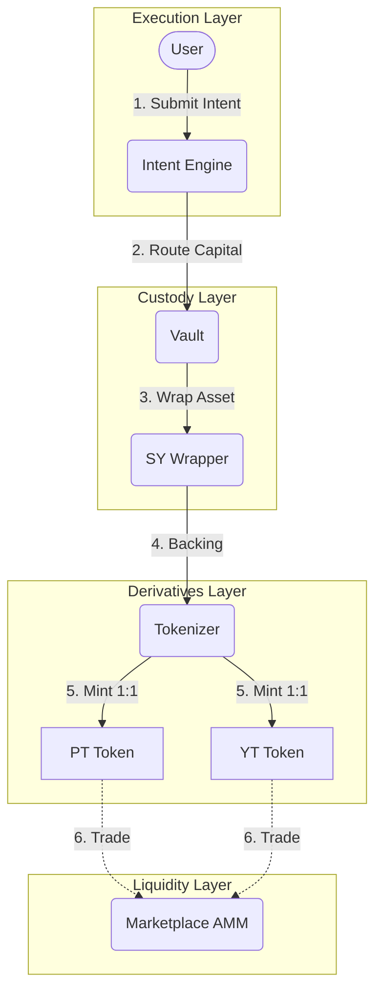
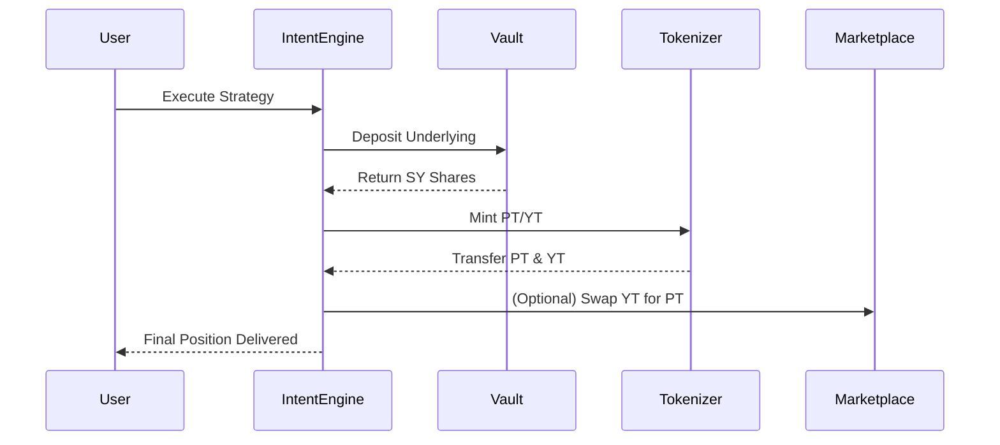

# Novaire Architecture

## Overview
Novaire is an institutional-grade protocol built on the Stellar network that enables the tokenization, separation, and trading of yield. By interacting with a modular suite of Soroban smart contracts, Novaire acts as the financial infrastructure for isolating future yield from principal assets, allowing markets to independently price the time-value of money.

## Core Design Principles
1. **Modularity:** Isolation of custody, tokenization, and market making into distinct, upgradeable smart contracts.
2. **Capital Efficiency:** Standardized Yield (SY) wrappers ensure underlying assets remain productive while their derivatives are traded.
3. **Intent-driven UX:** Users sign high-level intents rather than interacting with the complex underlying plumbing of tokenization and swaps.
4. **Market-driven Rates:** Yield is not determined by an oracle, but via an automated market maker (AMM) balancing the supply and demand of Principal Tokens (PT).

## Protocol Layers
1. **Asset Layer:** The base yield-bearing tokens (e.g., staked XLM, yield-bearing stablecoins).
2. **Custody Layer:** Vaults and SY Wrappers that secure the underlying assets and standardize their accounting.
3. **Derivatives Layer:** Tokenizers that mint fixed-term PT and YT against the SY wrapper.
4. **Liquidity Layer:** The Yield-Space AMM providing deep liquidity and price discovery for PT and YT.
5. **Execution Layer:** The Intent Engine, routing complex strategies into single atomic transactions.

## Architecture Diagram

## Detailed Lifecycle

### Yield Tokenization
Assets deposited into Novaire are mapped into a standardized accounting format (SY Wrapper). The Tokenizer locks these shares for a defined epoch (maturity period) and mints Principal Tokens (PT) and Yield Tokens (YT) perfectly backed by the locked assets.

### Principal Separation
The PT guarantees the holder exactly 1 unit of the underlying asset upon maturity. Before maturity, it trades at a discount. The depth of this discount implies the fixed interest rate of the market.

### Yield Separation
The YT guarantees the holder all variable yield generated by 1 unit of the underlying asset between the time of minting and maturity.

### Market Pricing
Prices are discovered on the Marketplace, an AMM specifically designed for time-decaying assets. As PT approaches maturity, its price approaches 1.0 underlying. The AMM invariant adjusts for this time decay to prevent impermanent loss.

### Redemption
Upon maturity, the Tokenizer stops accepting new mints for the expired epoch. PT holders can burn their PT to redeem the underlying principal 1:1.

### Portfolio Calculation
The frontend calculates portfolio value by evaluating:
`Wallet Underlying + (PT Balance * Spot Price) + (YT Balance * Spot Price) + Claimable Yield`

### Yield Accrual
Yield accrues within the Vault. The Tokenizer calculates the exchange rate between the underlying asset and SY shares. As the Vault's underlying balance grows from yield, the exchange rate increases, making YT more valuable.

### Automation & Rollover
The Rollover contract facilitates the automated migration of capital. Users can opt-in to automatically roll their matured PT into the next epoch, saving gas and maintaining continuous fixed-yield exposure.

### Analytics
Novaire indexes blockchain state to provide detailed historical TVL, APY trends, and volume metrics via the frontend API routes.

## Detailed Module Explanations

### Frontend Architecture
Built in Next.js 14, using React Server Components for performance and SEO. The frontend relies heavily on custom React hooks (`useTrade`, `usePortfolio`) that wrap the generated TypeScript bindings for the Soroban contracts.

### Backend Architecture
Next.js Serverless API routes act as the middle-layer to cache heavy RPC queries. Background cron-jobs or triggered syncs aggregate ledger data for charts.

### State Management
React Context combined with `SWR` handles real-time data fetching, caching, and revalidation of blockchain state.

### Wallet Interaction
Freighter wallet integration via `@stellar/freighter-api`. All transactions are assembled via `stellar-sdk`, signed by the user, and submitted to the Soroban RPC.

### Security Considerations
- **Sandwich Attacks:** Mitigated by the Intent Engine using TWAP (Time-Weighted Average Price) checks and slippage limits.
- **Yield Manipulation:** The SY Wrapper strictly segregates accounting, preventing flash-loan yield inflation.
- **Upgradability:** Contracts are currently immutable on Testnet to guarantee deterministic behavior. Future versions will utilize a DAO-governed proxy architecture.

### Testnet Deployment Flow
Deployment is handled via `scripts/deploy.ts` which uses the `stellar-cli` to compile the Rust contracts to WASM, deploy them, initialize them in topological order, and generate the strictly-typed TypeScript SDKs inside `/packages`.
