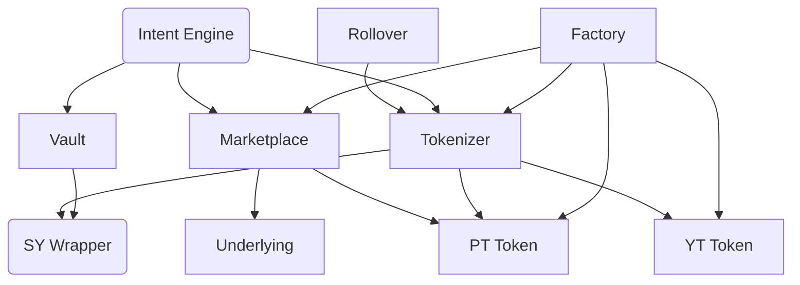
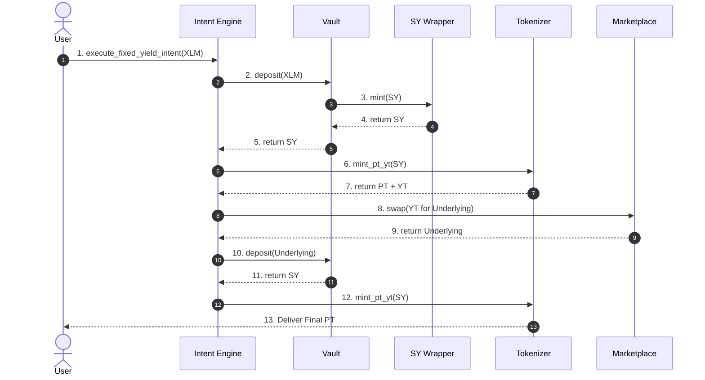

# Novaire Smart Contracts

This document provides a comprehensive breakdown of every smart contract comprising the Novaire protocol. All contracts are written in Rust using the `soroban-sdk` and are deployed on the Stellar network.

## Contract Dependency Graph

---

## 1. Factory Contract

**Purpose:** Automates the deployment and initialization of new epochs.

- **Responsibilities:** Deploys the Tokenizer, Marketplace, PT Token, and YT Token for a given maturity date. Links them securely together.
- **Storage:** Tracks deployed epochs mapped by their maturity ledger.
- **Core Functions:** `create_epoch(maturity_ledger)`
- **Events:** `EpochCreated`
- **Security Model:** Only the protocol admin can currently trigger epoch creation. Contracts are deployed deterministically.

## 2. Vault Contract

**Purpose:** Securely custodies user deposits of the underlying asset (e.g., XLM).

- **Responsibilities:** Receives underlying assets, interacts with the SY Wrapper to mint SY shares, and holds the assets securely.
- **Storage:** Total vault shares.
- **Core Functions:** `deposit(user, amount)`, `withdraw(user, shares)`
- **Events:** `Deposit`, `Withdraw`
- **Security Model:** Uses Stellar native authorization (`user.require_auth()`). Cannot move funds without user signature.

### Deposits, Withdrawals, and Shares
When a user deposits 100 XLM, the Vault calculates the current exchange rate and issues SY shares. If the exchange rate is 1.0, it issues 100 shares. Withdrawals burn shares to return the proportional underlying asset plus accrued yield.

## 3. SY Wrapper (Standardized Yield)

**Purpose:** Standardizes the accounting of disparate yield-bearing assets into a common interface.

- **Responsibilities:** Maintains the internal exchange rate between the underlying asset and the protocol shares.
- **Storage:** Internal exchange rate, total supply.
- **Interactions:** Exclusively called by the Vault and Tokenizer.

## 4. Tokenizer Contract

**Purpose:** The core yield-stripping engine. Mints and burns PT and YT.

- **Responsibilities:** Locks SY shares and issues PT and YT tokens 1:1 against the locked shares for a specific epoch.
- **Storage:** Epoch metadata, maturity ledger, total PT minted, total YT minted.
- **Core Functions:** `mint_pt_yt(user, sy_shares)`, `burn_pt_yt(user, pt_amount)`, `redeem_pt(user, pt_amount)`
- **Events:** `Mint`, `Burn`, `Redeem`
- **Lifecycle:**
  - *Pre-Maturity:* Users can mint PT and YT by locking SY shares, or burn PT and YT together to unlock SY shares.
  - *Post-Maturity:* Minting ceases. Users burn PT alone to redeem their base principal. YT holders claim accrued yield.

## 5. PT Token (Principal Token)

**Purpose:** Represents a zero-coupon bond for the underlying asset.

- **Responsibilities:** Standard Stellar asset interface (transfer, balance, allowance).
- **Core Functions:** `transfer`, `balance`
- **Principal Redemption:** At maturity, 1 PT can be burned at the Tokenizer for exactly 1 unit of the underlying asset.

## 6. YT Token (Yield Token)

**Purpose:** Represents leveraged exposure to the underlying asset's variable yield.

- **Responsibilities:** Standard Stellar asset interface.
- **Yield Accrual:** YT accrues value automatically as the Vault's underlying assets grow (via staking, lending, etc.).
- **Claimable Yield:** YT holders can periodically claim their accrued yield from the Tokenizer without selling the YT itself.

## 7. Marketplace Contract

**Purpose:** Yield-Space Automated Market Maker (AMM) enabling the trading of PT and YT against the underlying asset.

- **Responsibilities:** Provides deep liquidity, handles swaps, and derives the market-driven fixed interest rate.
- **Storage:** PT Reserve, Underlying Reserve, TWAP accumulators.
- **Core Functions:** `add_liquidity(pt, underlying)`, `swap_underlying_for_pt(amount)`, `swap_pt_for_underlying(amount)`, `get_pt_price()`
- **Security Model:** Constant product invariant `x * y = k` adjusted for time decay. Uses 1e9 scaled arithmetic to prevent rounding exploits.

### Pricing and Implied Yield
- **Spot Price:** Calculated dynamically based on the ratio of Underlying to PT in the reserves.
- **TWAP (Time-Weighted Average Price):** The contract updates a cumulative price accumulator on every swap. The Intent Engine uses this TWAP to prevent flash-loan price manipulation.
- **Market-driven Pricing:** The discount on PT directly equates to the fixed APY. If PT trades at 0.95 XLM and matures in 1 year, the implied APY is ~5.2%.

## 8. Intent Engine Contract

**Purpose:** Acts as a sophisticated transaction router to vastly simplify user experience.

- **Responsibilities:** Executes multi-step DeFi strategies in a single, atomic transaction.
- **Core Functions:** `execute_fixed_yield_intent(...)`
- **Security Model:** Slippage protection is enforced via TWAP checks. Reverts the entire transaction if the final output doesn't meet the user's minimum expected yield.

### Execution Flow
1. **Investment Intents:** User signs an intent (e.g., "Zap 100 XLM into Fixed Yield").
2. **Routing:** The Engine deposits to Vault -> Wraps in SY -> Mints PT/YT via Tokenizer -> Sells YT on Marketplace -> Uses proceeds to buy more PT.
3. **Settlement:** The user receives a single asset (PT) representing their locked fixed yield.

## 9. Rollover Contract

**Purpose:** Facilitates automated capital migration between expiring and new epochs.

- **Responsibilities:** Settles matured PT and automatically reinvests the proceeds into the subsequent epoch's PT.
- **Lifecycle:**
  - *Epoch Transitions:* When Epoch 1 matures, users normally have to manually redeem.
  - *Migration:* Users who opted-in to the Rollover contract have their PT automatically redeemed and their capital seamlessly forwarded into Epoch 2.

---

## Contract Interaction Diagram

## Deployment Order
To ensure correct initialization and dependency linking, contracts must be deployed in the following strict order:

1. Base Assets (Underlying token)
2. SY Wrapper
3. Vault (links to SY)
4. Tokens (PT / YT WASMs installed on ledger)
5. Marketplace WASM installed on ledger
6. Tokenizer WASM installed on ledger
7. Factory (links all above WASMs)
8. Intent Engine (links to Factory)
9. Rollover (links to Intent Engine and Factory)
