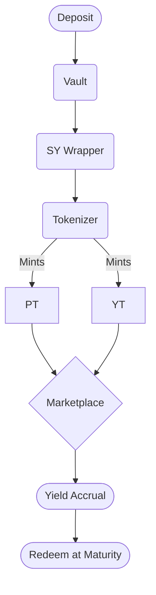
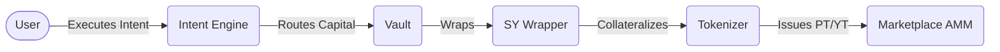

<div align="center">
  
  
  # Novaire
  
  **Institutional-grade yield tokenization protocol built on Stellar.**
  
  [](https://opensource.org/licenses/MIT)
  [](https://stellar.org/soroban)
  [](https://nextjs.org/)
  [](https://www.typescriptlang.org/)
  [](https://reactjs.org/)
  [](https://www.rust-lang.org/)
</div>

<br />

Novaire is a decentralized protocol that enables users to tokenize yield-bearing assets on the Stellar network. By abstracting the complexities of principal and yield separation into automated smart contracts, Novaire provides a permissionless foundation for advanced yield strategies, starting with isolated yield exposure and scaling into fixed-rate lending.

## Table of Contents
- [The Problem](#the-problem)
- [The Solution](#the-solution)
- [Key Features](#key-features)
- [Demo Flow](#demo-flow)
- [Screenshots](#screenshots)
- [Architecture Preview](#architecture-preview)
- [Tech Stack](#tech-stack)
- [Installation](#installation)
- [Local Development](#local-development)
- [Deploy Contracts](#deploy-contracts)
- [Run Frontend](#run-frontend)
- [Testing](#testing)
- [Roadmap](#roadmap)
- [Why Stellar](#why-stellar)
- [Security](#security)
- [Contributing](#contributing)
- [License](#license)

## The Problem
Yield in decentralized finance is fragmented, opaque, and volatile. Institutional and retail investors face significant risks when deploying capital into variable-rate money markets. Traditional finance relies heavily on robust fixed-rate instruments and yield-stripping derivatives to manage this volatility. However, the existing DeFi ecosystem lacks deeply liquid, capital-efficient markets that allow users to cleanly isolate and trade future yield independently from the underlying principal.

## The Solution
Novaire solves this by introducing **Yield Tokenization** on Stellar. Using Soroban smart contracts, Novaire wraps any yield-bearing asset and strictly bifurcates it into two distinct tradable tokens:
1. **Principal Tokens (PT):** A 1:1 claim on the base principal, redeemable at a fixed maturity date.
2. **Yield Tokens (YT):** A leveraged claim on the variable yield generated by the principal until that same maturity date.

## Key Features

**Core Protocol (Version 1)**
- ✅ **Yield Tokenization:** Permissionlessly strip yield from base assets.
- ✅ **Principal Tokens (PT):** Zero-coupon bonds representing future principal.
- ✅ **Yield Tokens (YT):** High-efficiency variable yield exposure.
- ✅ **Vaults:** Secure treasury management for underlying assets.
- ✅ **On-chain Marketplace:** Yield-Space AMM designed for time-decaying assets.
- ✅ **Intent Engine:** One-click abstract execution router.
- ✅ **Portfolio Dashboard:** Comprehensive analytics for active positions.
- ✅ **Analytics:** Deep dive into protocol TVL and historical trends.
- ✅ **Automation:** Epoch-driven automated rollovers.
- ✅ **Market-driven Pricing:** Implied yields driven purely by supply and demand.
- ✅ **Stellar Smart Contracts:** Rust-based robust Soroban contracts.
- ✅ **Stellar Testnet:** Fully operational deployment.

**Investment Strategies**
- ✅ **Keep All Yield** *(Working)*
- 🚧 **Fixed Yield** *(Coming Soon - Version 2)*
- 🚧 **Custom Yield Split** *(Coming Soon - Version 2)*

## Demo Flow

The typical lifecycle of capital in Novaire follows a strict, deterministic flow:



## Screenshots

| Dashboard | Portfolio |
| :---: | :---: |
|  |  |

| Trade | Analytics |
| :---: | :---: |
|  |  |

| Automation |
| :---: |
|  |

## Architecture Preview

Novaire uses a modular architecture separating asset custody, yield tokenization, and market making.



*(For deep technical details, see [ARCHITECTURE.md](ARCHITECTURE.md) and [CONTRACTS.md](CONTRACTS.md))*

## Tech Stack
- **Frontend:** Next.js 14, React 18, TailwindCSS, Framer Motion
- **Backend:** Next.js Serverless API Routes
- **Blockchain:** Stellar Network (Testnet)
- **Contracts:** Rust (soroban-sdk)
- **Wallet:** Freighter (Stellar native)
- **Deployment:** Vercel (Frontend), `stellar-cli` (Contracts)

## Installation

Ensure you have Rust, Node.js (v20+), and the `stellar-cli` installed.

```bash
# Clone the repository
git clone https://github.com/your-org/novaire.git
cd novaire

# Install dependencies
npm install

# Build smart contracts
make build
```

## Local Development

Start the Next.js development server:

```bash
npm run dev
```
Access the application at `http://localhost:3000`.

## Deploy Contracts

Deploy the protocol suite to the Stellar Testnet:

```bash
npm run deploy:testnet
```
This script handles building, deploying, and generating the TypeScript bindings in the `/packages` directory.

## Run Frontend

Once contracts are deployed and bindings generated, run the frontend with real testnet data:

```bash
npm run build
npm run start
```

## Testing

Run unit and integration tests across the smart contracts and frontend:

```bash
# Contract Tests
cargo test

# Frontend Tests
npm run test
```

## Roadmap

### Version 1 (Current)
- Base Yield Tokenization (PT / YT).
- Keep All Yield Strategy.
- Testnet AMM Marketplace and Vault integration.

### Version 2
- Fixed Yield Strategy (Guaranteed APY via PT).
- Custom Yield Splits.
- Expanded Asset Support.

### Version 3
- Mainnet Deployment.
- Advanced Analytics & Oracle Integration.
- DAO Governance & Cross-chain expansion.

## Why Stellar
Stellar’s Soroban smart contract platform provides unparalleled advantages for Novaire:
- **Fast Finality:** Crucial for accurate AMM pricing and smooth UX.
- **Low Fees:** Enables complex multi-step routing in the Intent Engine without burdening users.
- **Native Assets:** Deep interoperability with Stellar's robust financial ecosystem.

## Security
Novaire is designed with stringent security practices. Custody is isolated to the Vault and SY Wrapper. The Intent Engine uses TWAP to protect against sandwich attacks and price manipulation. 
*(Note: Novaire is currently on Testnet. Contracts are unaudited.)*

## Contributing
We welcome contributions! Please review our [CONTRIBUTING.md](CONTRIBUTING.md) for guidelines on code formatting, PR submission, and issue reporting.

## License
This project is licensed under the MIT License - see the [LICENSE](LICENSE) file for details.
