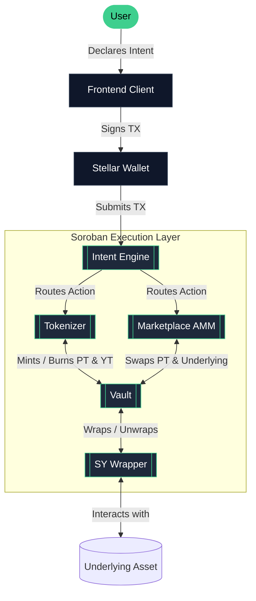
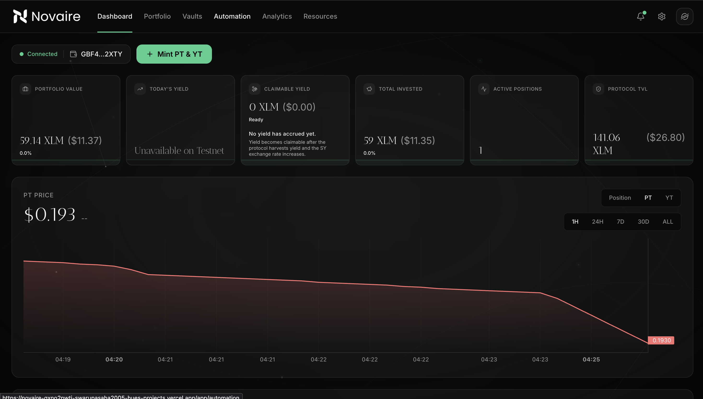
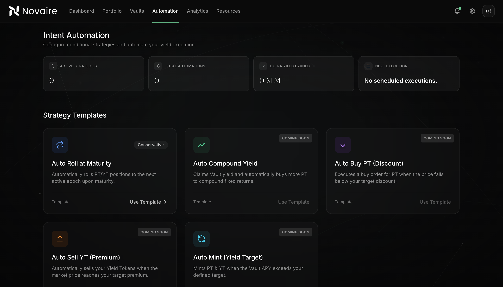
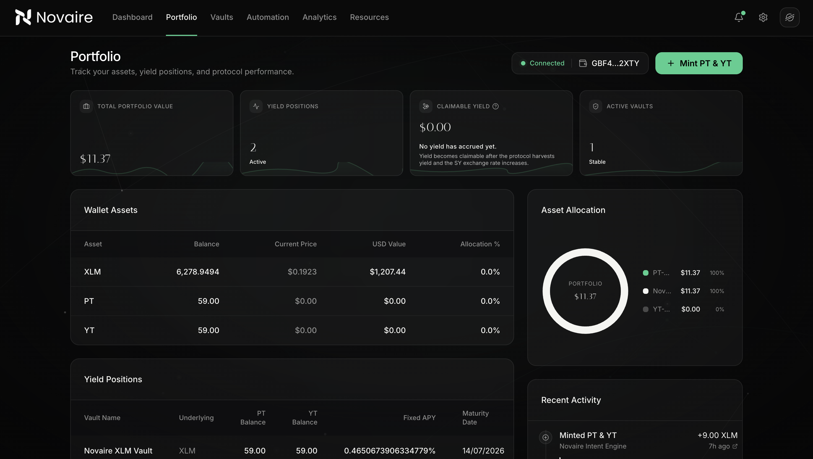
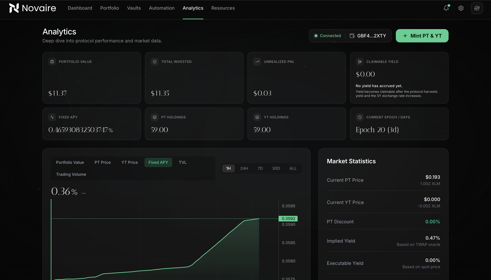
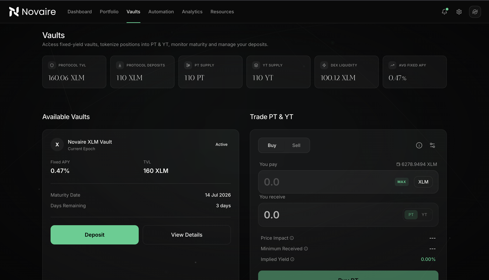

<div align="center">
  <h1 align="center">Novaire</h1>
  <p align="center">
    <strong>Intent-Based Fixed Yield Protocol on Stellar.</strong>
  </p>
  <p align="center">
    
    
    
    
    
  </p>
</div>

<br />

## Overview

Novaire introduces fixed-yield and yield-stripping mechanics to the Stellar ecosystem. By wrapping yield-bearing assets into Standardized Yield (SY), Novaire allows users to split their positions into two distinct components:

- **Principal Tokens (PT):** Represents the underlying principal. Buying PT secures a fixed yield if held to maturity.
- **Yield Tokens (YT):** Represents the yield generated by the underlying asset. Buying YT gives exposure to variable yield without locking up the principal.

Novaire simplifies fixed-yield DeFi through an **intent-based architecture**. Users declare their desired outcome (e.g., "Earn a fixed 10% APY on 100 XLM"), and the protocol automatically handles the complex backend routing—minting, swapping, and liquidity provision—in a single transaction.

---

## Why Novaire?

DeFi yields are volatile. Users providing liquidity or lending assets are subject to fluctuating interest rates, making it difficult to predict returns and plan financial strategies. 

**The Solution:**
Novaire provides a marketplace for fixed and variable yields. Users seeking predictable returns can lock in fixed rates by purchasing Principal Tokens at a discount. Advanced users can purchase Yield Tokens to gain leveraged exposure to yield fluctuations. This creates a highly efficient market for capital pricing on Stellar.

---

## Features

| Feature | Description |
| :--- | :--- |
| **Fixed Yield** | Lock in predictable, fixed interest rates by holding PT to maturity. |
| **Principal Tokens (PT)** | Claim 1-to-1 redemption of the underlying asset upon maturity. |
| **Yield Tokens (YT)** | Claim all yield accrued by the underlying asset until maturity. |
| **Intent-Based Investing** | Execute complex, multi-step DeFi actions in a single seamless transaction. |
| **Autonomous Rollovers** | Keep your capital working automatically by rolling matured positions into new epochs. |
| **Live Analytics** | Track Protocol TVL, active vaults, trading volumes, and implied APYs in real time. |
| **Portfolio Tracking** | Monitor your exact asset allocation, claimable yields, and position valuations. |
| **TWAP Pricing** | Ensure fair pricing and exploit-resistant execution via Time-Weighted Average Price oracles. |
| **Native Stellar Integration** | Built entirely on Soroban for lightning-fast, low-cost execution. |

---

## Architecture

Novaire's architecture routes user intents securely through the Soroban execution environment. 



---

## Screenshots

<details>
<summary>Click to view interface screenshots</summary>
<br/>

<div align="center">
  
  <p><em>Protocol Dashboard & Asset Allocation</em></p>
</div>

<div align="center">
  
  <p><em>Intent-Based Trading Interface</em></p>
</div>

<div align="center">
  
  <p><em>Portfolio & Yield Position Management</em></p>
</div>

<div align="center">
  
  <p><em>Market Analytics & APY Tracking</em></p>
</div>

<div align="center">
  
  <p><em>Vault Explorer</em></p>
</div>

</details>

---

## Mainnet Contract Addresses

| Contract | Mainnet Address |
| :--- | :--- |
| **Factory** | `To be updated after Mainnet deployment` |
| **SY Wrapper** | `To be updated after Mainnet deployment` |
| **Vault** | `To be updated after Mainnet deployment` |
| **Tokenizer** | `To be updated after Mainnet deployment` |
| **Marketplace** | `To be updated after Mainnet deployment` |
| **PT Token** | `To be updated after Mainnet deployment` |
| **YT Token** | `To be updated after Mainnet deployment` |
| **Intent Engine** | `To be updated after Mainnet deployment` |
| **Rollover** | `To be updated after Mainnet deployment` |

---

## How It Works

The Novaire lifecycle is designed for capital efficiency:

1. **Deposit:** Users deposit underlying assets into a Vault.
2. **Receive SY:** The protocol wraps the asset into Standardized Yield (SY).
3. **Mint PT & YT:** The Tokenizer splits the SY into Principal Tokens (PT) and Yield Tokens (YT).
4. **Trade:** Users can trade PT and YT on the Novaire Marketplace AMM to lock in fixed rates or speculate on yield.
5. **Earn Yield:** Holders of YT accumulate the variable yield generated by the underlying protocol over time.
6. **Redeem at Maturity:** PT holders redeem their tokens 1-to-1 for the underlying asset.

---

## Getting Started

### Prerequisites
- Node.js >= 18
- Rust and Cargo
- Soroban CLI

### Installation

Clone the repository and install dependencies:
```bash
git clone https://github.com/your-org/novaire.git
cd novaire
npm install
```

### Running Locally

Start the local development server:
```bash
npm run dev
```

The application will be available at `http://localhost:3000`.

### Building for Production

Create an optimized production build:
```bash
npm run build
npm start
```

---

## How to Use

1. **Connect Wallet:** Click "Connect Wallet" and authorize your Freighter or preferred Stellar wallet.
2. **Deposit:** Navigate to the **Vaults** tab to deposit an underlying asset.
3. **Mint PT/YT:** From your Portfolio or the Dashboard, use the Mint module to split your position.
4. **Trade:** Open the **Trade** tab to buy PT (lock in fixed yield) or buy YT (long variable yield).
5. **Track Portfolio:** Use the **Portfolio** tab to monitor your asset allocation and position health.
6. **Claim Yield:** YT holders can manually claim accrued yield directly from their active positions.
7. **Redeem:** After a vault matures, PT can be redeemed 1:1 for the underlying asset.

---

## Tech Stack

| Domain | Technology |
| :--- | :--- |
| **Smart Contracts** | Rust, Soroban SDK |
| **Network** | Stellar Network |
| **Frontend Framework** | Next.js, React |
| **Language** | TypeScript |
| **Styling & UI** | Tailwind CSS, Framer Motion |
| **Wallet Connection** | Freighter API, Stellar Wallets Kit |

---

## Security

Security is critical to Novaire's architecture:

- **Audited Protocol:** Designed for comprehensive security auditing prior to Mainnet launch.
- **Invariant Checks:** Rigorous math libraries ensure accounting precision for PT and YT issuance.
- **TWAP Pricing:** The marketplace uses Time-Weighted Average Pricing to resist flash loan and oracle manipulation attacks.
- **Safe Redemption:** PT claims are guaranteed post-maturity, isolated from AMM liquidity risks.
- **Native Soroban Contracts:** Built utilizing best practices for the Stellar execution environment.

---

## Roadmap

- [x] Testnet V1 Deployment
- [x] Intent Engine Implementation
- [x] Interactive Trading Dashboard
- [x] TWAP Oracle Integration
- [ ] Comprehensive Security Audit
- [ ] Mainnet V1 Launch
- [ ] Automation & Strategy Builder Release
- [ ] Multi-Wallet Support

---

## Repository Structure

<details>
<summary>Click to expand folder tree</summary>

```text
novaire/
├── contracts/               # Rust Soroban smart contracts
│   ├── factory/             # Protocol deployment factory
│   ├── intent_engine/       # Action routing and batch execution
│   ├── marketplace/         # AMM for PT/Underlying trading
│   ├── rollover/            # Autonomous vault rollovers
│   ├── sy_wrapper/          # Standardized yield tokenization
│   ├── tokenizer/           # PT & YT minting logic
│   └── vault/               # Core yield-bearing vaults
├── scripts/                 # Deployment and setup scripts
├── packages/                # Generated TypeScript bindings
└── src/                     # Next.js Frontend Application
    ├── app/                 # Page routing and layouts
    ├── components/          # Reusable UI components
    ├── config/              # Contract configurations and networks
    ├── hooks/               # Custom React hooks
    ├── services/            # Protocol interactions and data fetching
    ├── styles/              # Global styling
    └── types/               # Shared TypeScript interfaces
```
</details>

---

## License

This project is licensed under the MIT License - see the LICENSE file for details.
